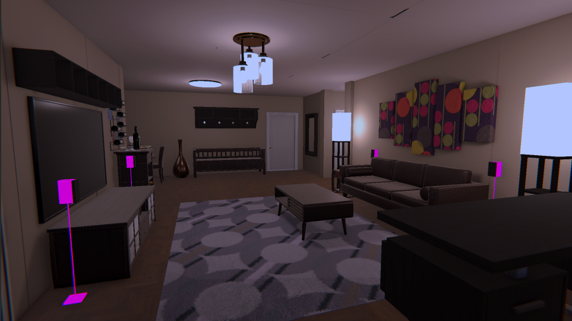

# Lab 02

Github link:[GitHub - KID0MY/Lab_02_CG ¡¤ GitHub](https://github.com/KID0MY/Lab_02_CG)

Youtube: [ShowCaseingTheScene - YouTube](https://youtu.be/47q91Wyc8V0)

# Post Processing 1:

For this first one, my idea behind was to just make some adjustments with Tonemapping and the Shadows, Midtones and Highlights, bringing a nicer look to the game.

Intended Mood: High-end, professional, and vibrant.

For This Post Processing, I mainly used: ToneMapping, Chromatic Aberration, and The Shadows, Midtones and Highlights.

# Post Processing 2:

For this second effect , my idea behind was to just try to use the environment to my advantage. I wanted to make a Black and White effect where the environment would transform into a noir space.

Intended Mood: Suspenseful, mysterious, and dramatic.

For This Post Processing, I mainly used: Lens Distorsion, Vignette, Color Adjustments and Film Grain.

# Post Processing 3:

For the third effect, Grand Theft Auto Drunk effect came into my mind. So by also using the environment to my favor I created a simple “drunken� post processing that utilizes not only the global volume but also a UV distortion shader.

Intended Mood: Disorienting, unstable, and dizzying.

For This Post Processing, I mainly used: Lens Distortion, and Color Adjustment.

Shader Graph:**
